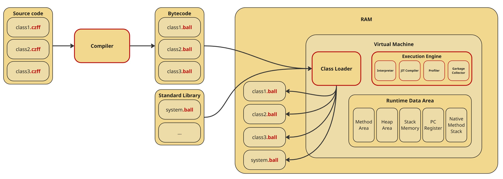

# CZFF-lang specification

1. [Overview](#overview)

    * [Purpose and Concepts](#purpose-and-concepts)

    * [System Architecture](#system-architecture)

        * [Schematic Diagram](#schematic-diagram)

        * [System Pipeline](#pipeline)

    * [Implementation Languages](#implementation-languages)

2. [Language Syntax and Semantics](#language-syntax-and-semantics)

    * [Characters](#characters)

    * [Comments](#comments)

    * [Tokens](#tokens)

    * [Literals](#literals)

    * [Constants](#constants)

    * [Types](#types)

        * [Primitive Types](#primitive-types)

        * [Composite Types](#composite-types)

        * [User-defined Data Types](#user-defined-data-types)

    * [Blocks, Scopes and Declarations](#blocks-scopes-and-declarations)

        * [Blocks](#blocks)

        * [Scopes](#scopes)

        * [Declarations](#declarations)

            * [Variable Declarations](#variable-declarations)

            * [Function Declarations](#function-declarations)

            * [Class Declarations](#class-declarations)

    * [Expressions and Operators](#expressions-and-operators)

        * [Arithmetic Operators](#arithmetic-operators)

        * [Comparison Operators](#comparison-operators)

        * [Logical Operators](#logical-operators)

        * [Function Calls](#function-calls)

        * [Array Access](#array-access)

        * [Member Access](#member-access)

    * [Statements](#statements)
    
        * [Assignment](#assignment)

        * [Control Flow](#control-flow)

            * [Conditions](#conditions)

            * [Loops](#loops)

    * [Exceptions](#exceptions)

3. [System Components](#system-components)

    * [Lexer and Parser](#lexer-and-parser)

    * [Bytecode Compiler](#bytecode-compiler)

    * [Virtual Machine (Runtime)](#virtual-machine-runtime)

        * [VM Architecuture](#vm-architecture)

        * [Memory Model and Management](#memory-model-and-management)

        * [Just-In-Time (JIT) Compiler](#jit-compiler)

4. [Standard Library](#standard-library)

5. [Code Examples](#code-examples)

## Overview

### Purpose and Concepts

* Imperative programming language

* Automatic memory management

* Interpreter + JIT-compiler for optimizing hot spots

* Statically typed

* Single-threaded

* Entry point - точка входа - (например, функция int main();)

### System Architecture

#### Schematic Diagram

#### Pipeline

* Lexer

* Parser

* Semantic analysis

* Intermediate Code Generation

* Optimizations

* Virtual machine

* Garbage Collector

* JIT-compiler (and Profiler)

### Implementation Languages

| Component | Language | Justification |
| --------- | -------- | ------- |
| `Lexer/Parser` |  |  |
| `Compiler` | |  |
| `Virtual Machine` | C++ | High performance and low-level access |

## Language Syntax and Semantics

### Characters

    new_line = "\n" ;
    whitespace = " " ;
    decimal_digit = "0" ... "9" ;
    letter = "A" ... "Z" | "a" ... "z" ;

### Comments

One-line comments start with the character sequence // and stop at the end of the line

General comments start with the character sequence =/ and stop with the first subsequent character sequence /=

### Tokens

* Identifiers

        identifier = letter , { letter | decimal_digit | "_" } ;

* Keywords

        break   class  continue else    
        for     func    if      new     
        return  while

* Operators

        +   -   *   /   %
        &&  ||  !   ==  =
        <   >   <=  =>  !=
        ++ --

* Puncuation

        ,   .   ;   :   
        (   )   {   }   [   ]

### Literals

    integer_literal = decimal_digit , { decimal_digit } ;
    string_literal = "\"" , { character - forbidden_character } , "\""
    bool_literal = "true" | "false" ;
    literal = integer_literal | string_literal | bool_literal ;

    forbidden_character = "\"" | new_line

character - arbitrary Unicode symbol

### Types

#### Primitive Types

* bool - *true* or *false*

* int - the set of all signed 64-bit integers

#### Composite Types

* string - sequence of characters

* array<*type*> - sequence of elements of a single type

#### User-Defined Data Types

* class - a set of of named elements, called fields, and functions, called methods.

### Blocks, Scopes and Declarations

#### Blocks

A block is a sequence of declarations and statements within matching brace brackets

    block = "{" , { statement , ";" } , "}" ;

#### Scopes

Scope is the context in which a name is visible. Scope types:

* Class scope

* Function scope

* Statement scope (*if*, *for*...)

#### Declarations

    declaration = variable_declaration | function_declaration | class_declaration ;

#### Variable Declarations

    type = "bool" | "int" | "string" | "array<" , type ">" | identifier
    primitive_type_declaration = "var" , int | bool , identifier , [ "=" , expression ] , ";" ;
    string_declaration = "var" , "string" , identifier , [ "=" , expression ] , ";" ;
    array_declaration = "var" , "array<" , type ">" , identifier , [ "=" , new , "(" , integer_literal , ")" , "[" , { , identifier , "," , } "]" ] , ";"
    class_declaration = "var" , identifier , identifier , [ "=" , expression ] ,  ";" ;
    variable_declaration = primitive_type_declaration | string_declaration | array_declaration | class_declaration ;

#### Function Declarations

    function_declaration = "func" , func_return_type , function_name , "(" , [ parameter_list ] , ")" , function_body ; 
    function_name = identifier ;
    func_return_type = type | "void" ;
    parameter_list = parameter , { "," , parameter } ;
    parameter = type , identifier ;
    function_body = block ;

#### Class Declarations

    class_declaration = "class" , class_name , class_body ;
    class_name = identifier ;
    class_body = "{", { class_member } , "}" ;
    class_member = field | constructor | method ;
    field = variable_declaration ;
    method = function_declaration ;
    constructor = class_name , "(" , [ parameter_list ] , ")" , function_body ;

### Expressions and Operators

Expression is a piece of code that can be evaluated to a value

    expression = unary_expression | expression , binary_operation expression ;
    unary_expression  = primary_expression | unary_operator , unary_expression ;
    unary_operator = "-" | "!"  ;
    binary_operation = arithmetic_operator | logical_operator | comparison_operator ;
    primary_expression = literal 
                         | identifier 
                         | function_call 
                         | array_access 
                         | member_access ;

#### Arithmetic Operators

    arithmetic_operator = "+" | "-" | "*" | "/" | "%" ;

### Increment and Decrement

    increment_decrement = "++" | "--" ;

#### Comparison Operators

    comparison_operator = "==" | "!=" | "<" | "<=" | ">" | ">=" ;

#### Logical Operators

    logical_operator = "&&" | "||" | "!" ;

#### Function Calls

    function_call = function_name , "(" , [ arguments ] , ")" ;
    arguments = expression , { "," , expression } ;

#### Array access

    array_access = identifier , "[" , expression , "]" ;

#### Member access

    member_access = identifier , "." , identifier ;

### Statements

Statement is the piece of code that tells the computer to do something

    statement = expression_statement
                | increment_decrement_statement
                | assigment 
                | declaration 
                | break_statement
                | continue_statement
                | return_statement  
                | if_statement
                | for_statement
                | while_statement
                | io_statement
    expression_statement = expression ;
    increment_decrement_statement = expression , increment_decrement  ;

#### Assignment

    assigment = identifier | array_access | member_access , "=" | expression ;

### Control Flow

#### Conditions

    if_statement = "if" , "(" , expression , ")" , block , { "elif" , "(" , expression , ")" , block } [ "else" , block ] ;

#### Loops

    break_statement = "break" ;
    continue_statement = "continue" ;
    return_statement = "return" , [ expression ] ;

 

    for_statement = "for" , "(" , for_init , ";" , for_condition , ";" , for_post  ")" , block ;
    for_init = varaible_declaration ;
    for_condition = expression ;
    for_post = expression ;

 

    while_statement = "while" , "(" , expression ")" , block ;

### Exceptions

If an exception occurs, we will stop the program, write the error code, and display an error message

## System Components

### Lexer and Parser

Step 1. Lexer

Program which will convert a text into lexical tokens belonging to categories include identifiers, operators, data types, language keywords.

Step 2. Parser

The tokens are then parsed into AST (abstract syntax tree) by the parser.

Step 3. Semantic Analysis

* Type checking
    * Check operands types (for example, adding string to int is prohibited)
    * Data types of operands in expressions match the expected data type
    * Check argument types for function calls 

* Undefined and unassigned variables checking

* Scope checking

    Check that variables are used within the scope they were defined

* Flow control check 
    Check that statements like "return" or "break" are used correctly.

Also we may do some optimizations like Constant Folding and detecting unreachable code (for example, after "return" statement)

### Bytecode Compiler
- [Bytecode specification](./docs/bytecode/bytecode.md)
- [Compiler specification](./docs/bytecode/compiler.md)

### Virtual Machine (Runtime)

#### VM Architecture

Czff programming language virtual machine's architecture is _stack-based_ and is based on the practices of the specifications for JVM. For detailed information, see [VM Architecture section](./docs/virtual-machine/vm-architecture.md).

#### Memory Model and Management

Memory management is accomplished through two main components:

1) [Runtime Data Area](./docs/virtual-machine/runtime-data-area.md) (storing objects according to their type)

2) [Garbage Collector](./docs/virtual-machine/execution-engine/garbage-collector.md) (removing inaccessible objects from memory)

#### JIT Compiler

On JIT compilation see [JIT Compiler](./docs/virtual-machine/execution-engine/jit-compiler.md) section.

## Standard Library

* Input and Output

    * print
    
    * println
    
    * read (until end of line or whitespace)
    
    * readline (until end of line)

     

        io_statement = print_statement | read_statement ;
        print_statement = "print" | "println" , "(" , [ expression , { "," , expression } ] , ")" , ";"
        read_statement = "read" | "readln" , "(" , identifier , ")" , ";"

## Code Examples

* Factorial calculation

        =/
        Factorial calculation
        /=
        class FactorialCalculator {
            func int Calculate(int n) {
                if (n <= 1) {
                    retrun 1;
                }

                return n * Calculate(n - 1);
            }

            func void Main(array<string> args) {
                var int n = 10;
                print(Factorial(n));
            }
        }

* Array Sorting

        =/
        Merge Sort Implementation
        /=
        class ArrayMergeSorter {
            func void Merge(array<int> arr, int left, int mid, int right) {
                var int it1 = 0;
                var int it2 = 0;
                var array<int> result = new (right - left)[]; // create array with size right - left

                while (left + it1 < mid && mid + it2 < right) {
                    if (arr[left + it1] <= arr[mid + it2]) {
                        result[it1 + it2] = arr[left + it1];
                        it1++;
                    } else {
                        result[it1 + it2] = arr[mid + it2];
                        it2++;
                    }
                }

                while (left + it1 < mid) {
                    result[it1 + it2] = arr[left + it1];
                    it1++;
                }
                                
                while (mid + it2 < right) {
                    result[it1 + it2] = arr[mid + it2];
                    it2++;
                }

                for (var int i = 0; i < it1 + it2; i++) {
                    arr[left + i] = resilt[i];
                }
            }

            func void MergeSort(array<int> arr, int left, int right) {
                if (left + 1 >= right) {
                    return;
                }

                var int mid = (left + right) / 2;
                MergeSort(arr, left, mid);
                MergeSort(arr, mid, right);
                Merge(arr, left, mid, right);
            }

            func void Main(array<string> args) {
                var int n;
                read(n);
                var array<int> arr = new (n)[]; // create array with size n
                for (var int i = 0; i < n; i++) {
                    read(arr[i]);
                }
                MergeSort(arr, 0, n);
                for (var int i = 0; i < n; i++) {
                    print(arr[i], " ");
                }
            }
        }

* Prime Number Generation

        class EratosthenesSieve {
            func void Main(array<string> args) {
                var int n;
                read(n);
                var array<bool> prime = new (n + 1)[];
                for (var int i = 2; i < n + 1; i++) {
                    prime[i] = true;
                }
                for (var int p = 2; p * p <= n; p++) {
                    if (prime[p] == true) {
                        for (var int i = p * p; i <= n; i = i + p) {
                            prime[i] = false;
                        }
                    }
                }
                println("Prime numbers up to ", n);
                for (var int i = 2; i <= n; i++) {
                    if (prime[i] == true) {
                        print(i, " ")
                    }
                }
            }
        }