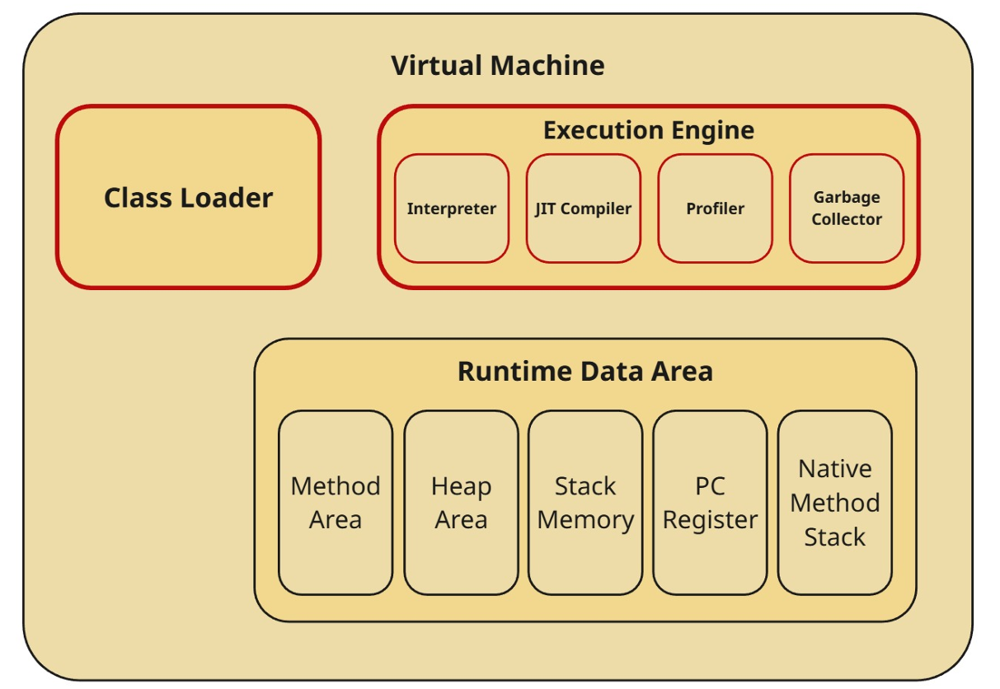

# Virtual Machine Architecture

## Main Components

### [Class Loader](./class-loader.md)

The first thing that runs in the virtual machine is the class loader, which loads `.ball` files (containing bytecode) into RAM, performs linking, and initializes static variables.

### [Runtime Data Area](./runtime-data-area.md)

The Runtime Data Area is divided into five areas, into which objects are placed according to specific rules.

### [Execution Engine](./execution-engine/execution-engine.md)

Program execution is handled by the Execution Engine, which consists of an [Interpreter](./execution-engine/interpreter.md) that translates bytecode into machine code, a [Garbage Collector](./execution-engine/garbage-collector.md) that removes objects unreachable from the program, a [Profiler](./execution-engine/profiler.md) that identifies areas of optimization for the JIT compiler, and the [JIT Compiler](./execution-engine/jit-compiler.md) itself.
